Membuat repository di github


Menginisialisasi project kita menjadi git repository
```Bash
git init
```
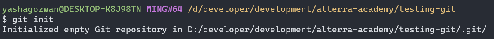

Membuat branch development dan pindah langsung ke development
```Bash
git checkout -b development
```
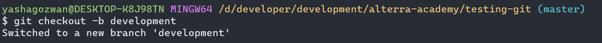

Membuat branch featureA dan pindah lansung
```Bash
git checkout -b featureA
```


Membuat file di folder praktikum yang bernama task.dart selanjut nya menambahkan satu variable name di file tersebut.
```dart
void main() {
  String name = 'Yasha Gozwan Shuhada';
}
```

Mengirimkan perubahan yang berada di local kita ke remote origin Github
```Bash
git add .
git commit -m "Menambahkan variable name"
git push origin featureA
```

Membuat branch baru dari development dengan nama branch featureB kita synchronize dengan branch featureA dengan menggunakan perintal pull
```Bash
  git checkout -b featureB
  git pull origin featureA
```


Menambahkan variable age
```dart
void main() {
  String name = 'Yasha Gozwan Shuhada';
  int age = 26;
}

```

Menambahkan function sayHello
```dart
void sayHello() => print('Hello World');
```

Ketika kita ada perubahkan dan kita salah mengerjakan di file yang tidak seharus nya. Kita bisa menggunakan git stash
```Bash
git status
git stash
git stash apply
```
Melihat perubahan di file
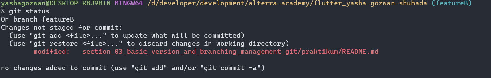

Memindahkan ke stash area untuk kita pindahkan ke branch yang benar
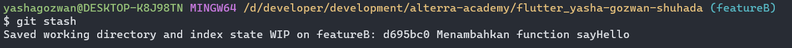

Kita pindahkan ke branch yang benar
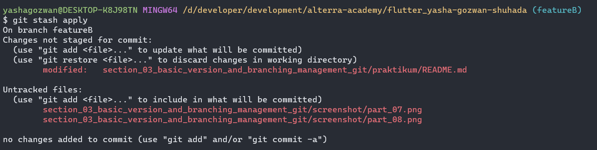

Kita implemetasi merge branch featureA dan featureB di branch development dan merge juga development di branch master
Merge development <- featureA
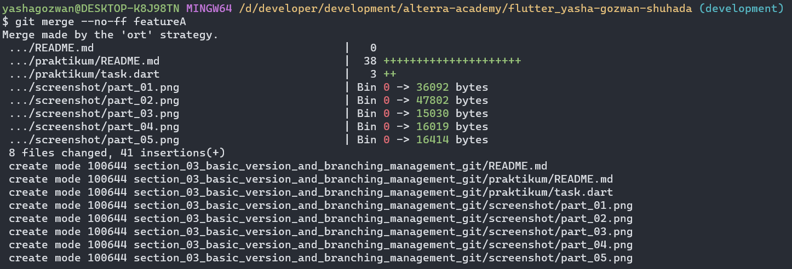

Merge development <- featureB
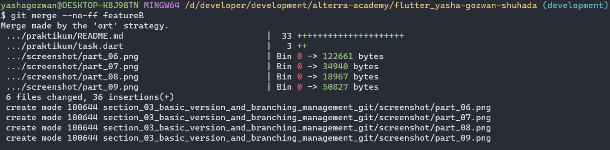

Merge master <- development
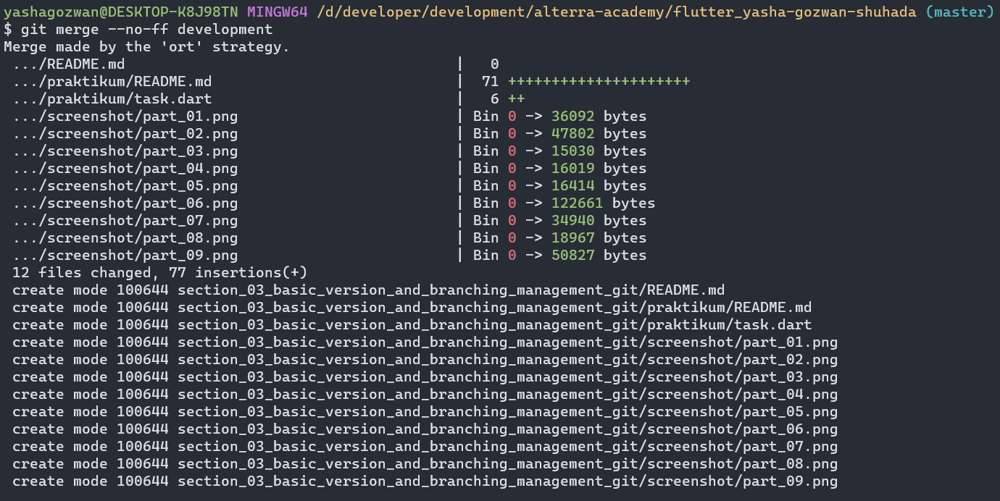

Kita implemetasi conflict
kita membuat file person di branch featureA
```dart
class Person {
  String? name;
  int? age;
  String? email;
}
```

kita membuat file person di branch featureB
```dart
class Person {
  String? name;
  int? age;
}
```

kita akan merge branch featureA dan featureB dari branch development dan akan terjadi conflict karena file di branch tersebut sama.
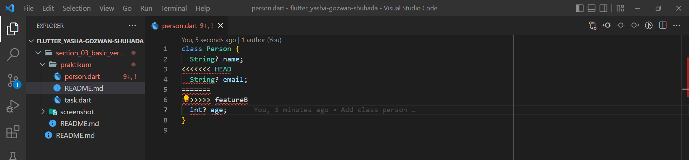

Kita perbaiki menjadi seperti ini.
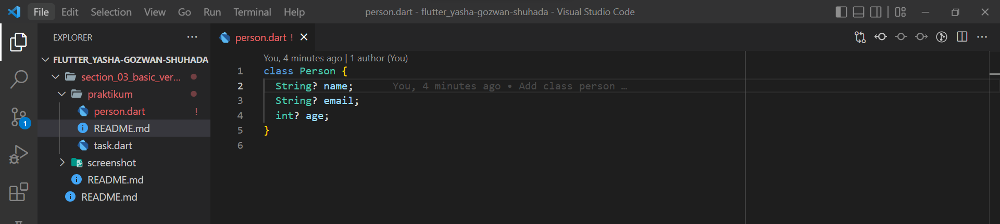

Lalu kita kirim ke github
```
git add .
git commit -m "merge featureA dan featureB"
git push origin development
```

kita merge development ke master
```
git checkout master
git merge --no-ff development
git push origin master
```

### Network graph.
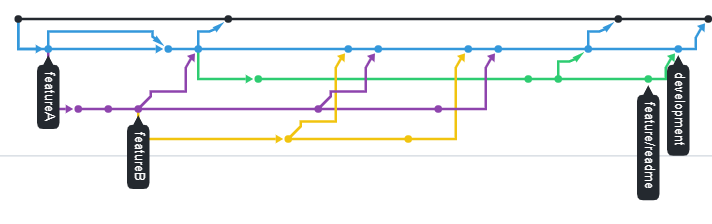
### Git Graph
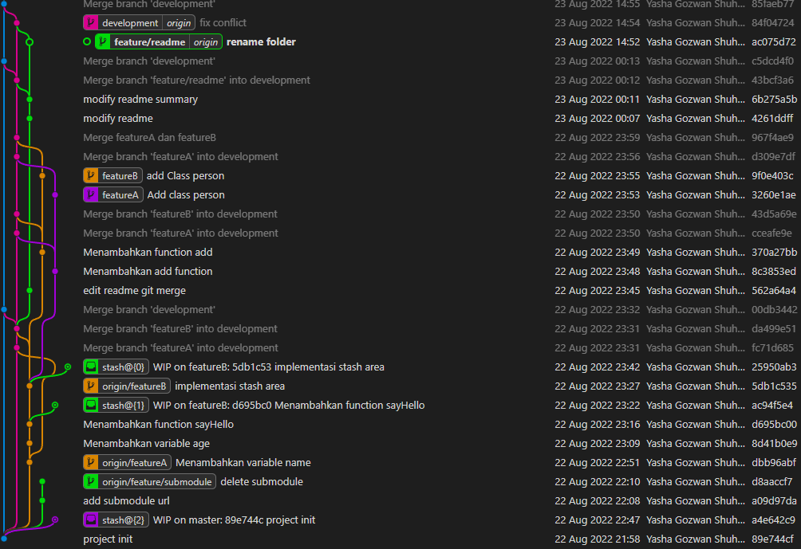